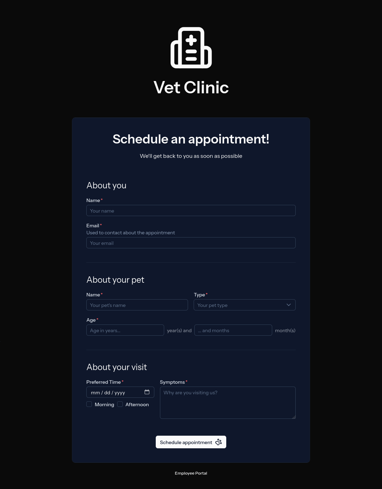
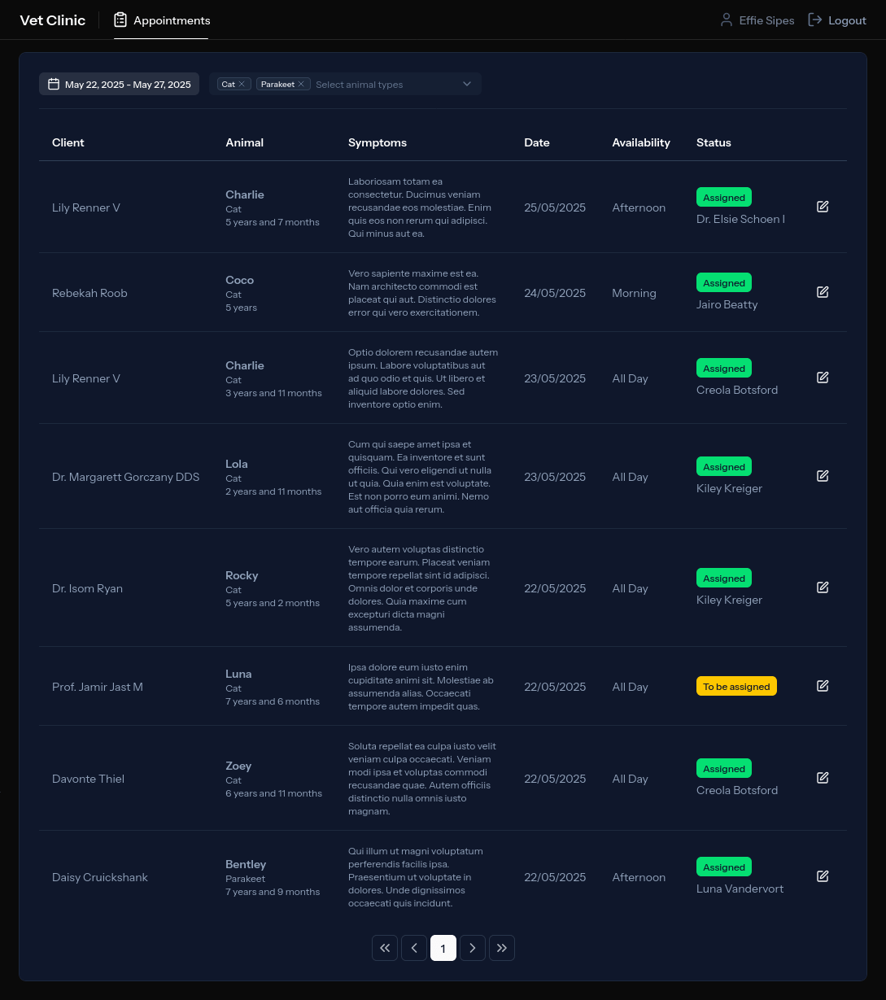
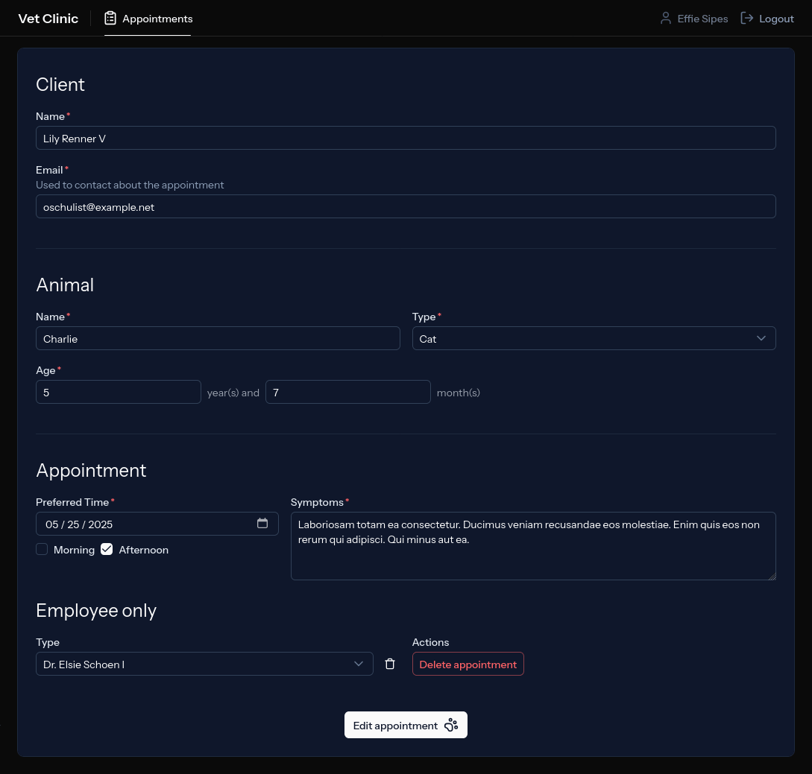
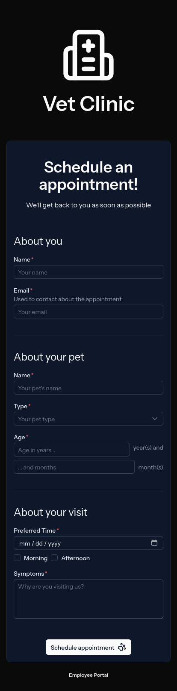

# Laravel + Vue showcase

Based on [Laravel + Vue Starter Kit](https://github.com/laravel/vue-starter-kit). Laravel 12 and Vue 3.

Uses [Inertia](https://inertiajs.com) to connect the backend to the frontend.
Leverages [Tailwind](https://tailwindcss.com) using [Nuxt UI](https://ui.nuxt.com).

## Vet Clinic

_[[Screenshots]](#screenshots)_

- **Clients** schedule their own appointments
- Clients can select an existing type of animal or create a new one
    - After the appointment is confirmed, the new type of animal can be selected by other clients
- **Receptionists** can view, edit, and delete all appointments
- Receptionists confirm and assign appointments to medics
    - Clients receive an email when their appointment is confirmed/assigned to a medic
- **Medics** can only edit their own appointments
    - They can also choose to see only their appointments or all of them
- Appointments can be filtered by date and types of animal

### Highlights

- Mobile-friendly and responsive design
- **Policies** are used to manage authorization
- **Form requests** are used to filter and validate user submitted data
- **Forms** are automatically validated before submitting, using precognition
- **Resources** are used to limit the information sent to the frontend
    - Can conditionally return different data using a custom trait (see [AppointmentResource](https://github.com/joaopms/laravel-vue-showcase/blob/main/app/Http/Resources/AppointmentResource.php))
- **Browser tests** using Laravel Dusk and **HTTP tests** using Pest
- **Database transactions** ensure data integrity
- Single database table for authenticated users (receptionists and medics)
- An appointment consists of three tables: appointments - animals - clients
    - Clients can have multiple animals (1-N)
    - Animals can have multiple appointments (1-N)

### Future work

- Type-hinting data in the frontend
- Caching of animal types
- Rate limiting for scheduling appointments
- Write unit tests for [AgeParser](https://github.com/joaopms/laravel-vue-showcase/blob/main/app/Helpers/AgeParser.php)
- Cover the whole codebase with tests
- Re-use and better organize code, specially in the frontend
- Mobile-friendly appointment list on the employee portal
- Finish the implementation of the [ResourceConditions](https://github.com/joaopms/laravel-vue-showcase/blob/main/app/ResourceConditions.php) trait
- Remove or improve left over code from the starter kit
- Run browser tests automatically with GitHub actions

## Instructions

### Developing with NixOS

This project was developed using NixOS and a development environment was setup.
It can be activated by running `nix develop` in the project directory.

```shell
# Activate dev shell
nix develop
```

### Running for the first time

```shell
# Install dependencies
composer install
npm install

# Create .env file (and ask before overwriting)
cp -i .env.example .env

# Create the database file used for browser tests (set by DB_DATABASE_NAME in .env.dusk.local)
touch database/database_dusk.sqlite

# Create app key
php artisan key:generate

# Database migrations
php artisan migrate

# Seed the database
php artisan seed

# Build the frontend
npm build

# Run everything, including Mailpit
composer run dev
```

### Running the project

```shell
# Run everything, including Mailpit
composer run dev
```

#### Test accounts

The database seeder creates two accounts: one receptionist and one medic.

| Type         | Email                   | Password |
|--------------|-------------------------|----------|
| Receptionist | receptionist@vet.clinic | password |
| Medic        | medic@vet.clinic        | password |

## Screenshots


*Home: Schedule appointment*


*Employee portal: List appointments*


*Employee portal: Edit appointment*


*Home (mobile)*
